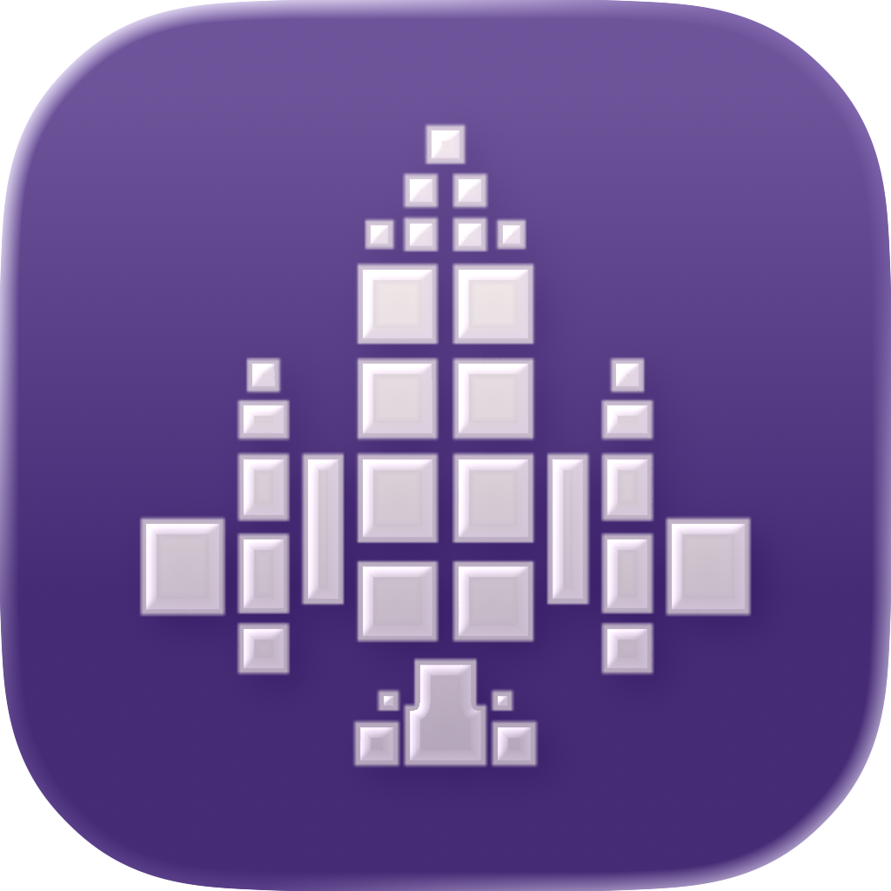

  
  
  # 🚀 Project: Universal (Idle Clicker)
  ### *«В бескрайней пустоте космоса мусор одного — это билет домой для другого.»*

**Universal (Hyperjump: Scavenging the Void)** — это idle-кликер о выживании одинокого корабля в недружелюбной галактике. Ваша цель: собирать пролетающий мусор, расширять отсеки своего корабля и накопить достаточно мощности для финального гиперпрыжка. 

> ⚠️ **ВНИМАНИЕ: Игра разрабатывается СТРОГО под платформу Android (портретная ориентация, 1080x2400).** 
> *Сборкой и тестированием APK занимается **Программист 1 (Build Master)***.

---

## 🛠 Архитектурные принципы

Проект строится на трех архитектурных столпах для чистоты кода и избежания Git-конфликтов:

1.  **Feature-based Folders:** Все ресурсы конкретной фичи (скрипты, сцены, спрайты) лежат в одной папке.
2.  **Event Bus (Сигнальная шина):** Объекты не знают друг о друге (никаких `get_parent()`). Они общаются исключительно через глобальный синглтон `GameEvents`.
3.  **Composition over Inheritance:** Мы собираем функционал из переиспользуемых узлов-компонентов (например, `ClickableComponent`), а не плодим гигантские иерархии наследования.
4.  **Data-Driven Design:** Баланс (цены, таймеры) хранится в файлах `.tres` (Resource), чтобы геймдизайнеры не трогали код.

---

## 👥 Роли, Границы и Задачи (Как не мешать друг другу)

В команде 3 программиста. Главное правило: **ЗАПРЕЩЕНО напрямую редактировать `main.tscn`.** Каждый работает строго в своей директории и в своих сценах, которые уже подключены в `main.tscn` как инстансы.

### 🧑‍💻 Программист 1: Core, Архитектура и Билды (Build Master)
**Зона ответственности:** Глобальные системы, Автозагрузки, сохранение, сетка, экспорт APK на Android.
**Рабочие директории:** `core/`
**Последовательность создания функций:**
1. Настроить базовый `GridManager` (проверка занятости клеток 12x20).
2. Реализовать `ResourceManager` (добавление/трата металла, лимиты).
3. Добавить поддержку сохранения/загрузки прогресса (ресурсы и позиции комнат).
4. **Сборка тестовых билдов Android (.apk) и выдача команде.**

### 🧑‍💻 Программист 2: Entities и Геймплей (Сущности)
**Зона ответственности:** Объекты на поле (мусор, модули корабля), клики, автоматизация сбора.
**Рабочие директории:** `entities/`, `shared/`
**Последовательность создания функций:**
1. Создать базовую сцену мусора (`Debris`) с `ClickableComponent`.
2. Реализовать спавнер мусора (летит справа налево, макс. 5 штук на экране).
3. Создать логику "Ядра" и базовых модулей (визуальное размещение в сетке).
4. Реализовать логику "Сборщика" (автоматический сбор мусора в радиусе 1 клетки).

### 🧑‍💻 Программист 3: UI, Камера и Мета-игра (Интерфейс)
**Зона ответственности:** Весь интерфейс (HUD, магазин), камера, баланс (.tres).
**Рабочие директории:** `ui/`, `data/`
**Последовательность создания функций:**
1. Оживить UI ресурсы: привязать счетчик металла к сигналам `ResourceManager`.
2. Реализовать логику кнопок "Построить" (вызов меню или режима размещения).
3. Сделать динамическую камеру (зуммирование (отдаление) когда корабль разрастается > 10 ячеек).
4. Экран "Победы" (достигнут размер 6x6 и есть нужные модули).

---

## 📡 Протокол взаимодействия (Event Bus)

**Никаких прямых ссылок!**
Пример: Если Программист 2 (Entities) сделал так, что мусор собран, он НЕ лезет в UI Программиста 3. Он делает так:
`GameEvents.garbage_clicked.emit(amount)`

А скрипт Программиста 1 (`ResourceManager`) ловит это событие, прибавляет ресурс и вызывает:
`GameEvents.resource_changed.emit("metal", new_total)`

Скрипт Программиста 3 (`MainUI.gd`) ловит `resource_changed` и обновляет текст на экране. 
**Итог: полная изоляция и никаких конфликтов.**

---

## 🚀 С чего начать?

1.  Клонируй репозиторий.
2.  Открой проект в Godot 4.x.
3.  Определи свою роль (1, 2 или 3) и работай ТОЛЬКО в своих папках.
4.  Делай атомарные коммиты: одна фича/фикс = один коммит.

---
*Помни: каждый раз, когда ты делаешь `get_node("/root/Main/Some/Very/Long/Path")`, в космосе взрывается одна сверхновая. Используй сигналы!*
